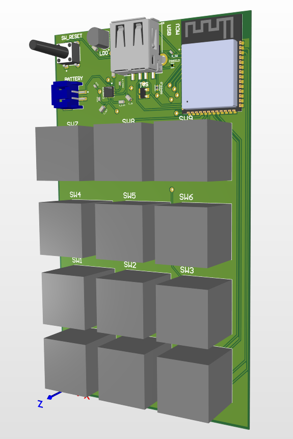
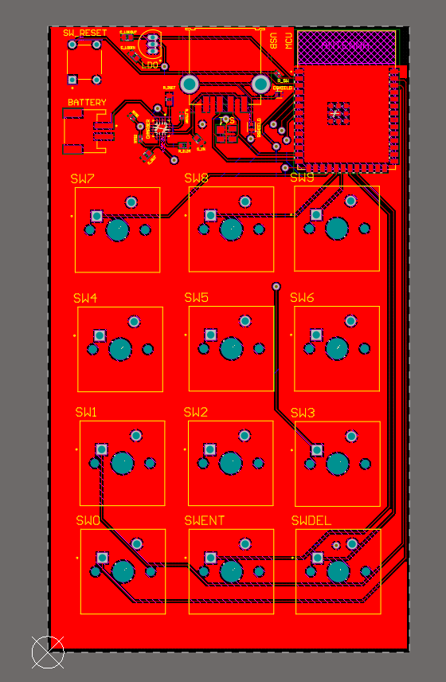
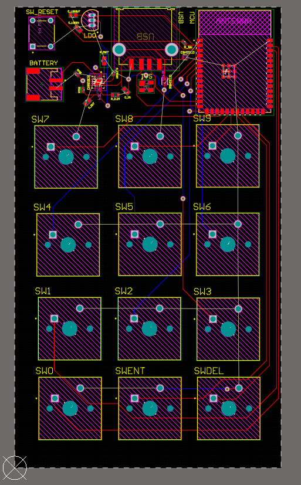

<h1 align="center">ESP32-S3 Numpad (Bluetooth/USB)</h1>

<h2>Project Overview</h2>

This project is a custom 12-key numpad built around the ESP32-S3-WROOM-1 module, developped as a project to learn about PCB design. 
The system supports both Bluetooth Low Energy (BLE) HID and USB HID operation, allowing it to function as a standalone wireless or wired keyboard.

<h2>Hardware Features</h2>
<ul>
  <li><b>Key Input</b>:
    <ul>
      <li>12 individual mechanical switch footprints arranged in a numpad configuration</li>
      <li>Direct GPIO mapping for reduced latency</li>
      <li>Internal pull-up resistors utilized for simplified hardware design</li>
    </ul>
  </li>
  <li><b>Power Management</b>:
    <ul>
      <li>BQ24074 battery charger and power-path management IC</li>
      <li>Uses 500 mAh LiPo battery</li>
      <li>Simultaneous operation while charging via USB</li>
    </ul>
  </li>
  <li><b>Connectivity</b>:
    <ul>
      <li>USB 2.0 connector for both data and power</li>
      <li>ESD protection on USB data lines via TVS diode</li>
    </ul>
  </li>
  <li><b>System Control</b>:
    <ul>
      <li>Dedicated reset button for programming and debugging</li>
    </ul>
  </li>
  <li><b>PCB Design</b>:
    <ul>
      <li>Developed in Altium</li>
    </ul>
  </li>
</ul>

<h2>Firmware Features</h2>
<ul>
  <li>Implemented using the Arduino framework for ESP32</li>
  <li>Provides both BLE HID keyboard and USB HID keyboard operation</li>
  <li>Automatic deep sleep feature after 3 minutes of inactivity</li>
</ul>

<h2>Files</h2>
<ul>
  <li><code>main</code> – Source code for ESP32-S3</li>
  <li><code>numpad.schdoc</code> – Altium schematic file</li>
  <li><code>pcb_numpad.pcbdoc</code> – PCB file</li>
</ul>

<h2>Potential Extensions</h2>
<ul>
  <li>RGB backlighting integration</li>
  <li>Expansion to larger key matrices or custom layouts</li>
</ul>

<h2>PCBWay Review</h2>
<ul>
  Soon after uploading my design and code to Github, I was contacted by PCBWay who offered to prototype the board. Though the project was sponsored by them, this review is completely honest and not influenced in any way by PCBWay.

The ordering process was straightforward: I uploaded my Gerber files and their review team quickly verified everything before payment and production. The boards arrived about a week later, firmly packaged in a tight bubble wrap.

In terms of quality, the silkscreen labeling stood out to me, as it is very clear, even for the smaller text on my board. The pads are well aligned and fit my components perfectly. The solder mask has a smooth finish, and overall the board looks very nice.

Unrelated to the board itself, I appreciated the communication from PCBWay. I'm not sure how other PCB manufacturers do it, but PCBWay constantly provided updates along every step of production and shipment, so I always knew exactly what was going on with my boards or where my boards were.

Overall, the quality is solid and dependable and the process is simple (even for a beginner). I'll be using PCBWay again for future projects and I encourage you to look into them and maybe give them a try.

https://www.pcbway.com
</ul>

<h2>Images</h2>
<table align="center">
  <tr>
    <td align="center">
       
      <i>PCB 3D Model</i>
    </td>
    <td align="center">
       
      <i>PCB Design</i>
    </td>
    <td align="center">
       
      <i>PCB Design (Removed Ground Pour for Visibility)</i>
    </td>
  </tr>
</table>
